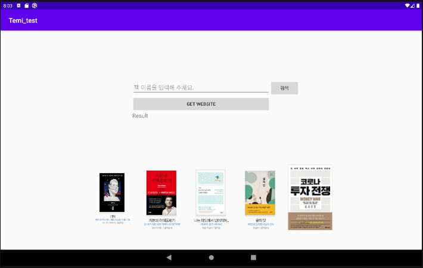

# TEMI Service
## ICT Fusion Robotics 
- Book Store Service  
- [Team 3]   
TEAM LEADER : 박영준   
APPLICATION : 황인재 유승주  
EMBEDDED    : 김민영 박영준  
DATABASE    : 건호  김주연  
---
## Proto type

## Advanced type

## Test 

## Arduino

## Raspberry
- ROS Serial Communication  

    sudo iw reg set US  
    rosrun beginner_tutorials firebase.py   
    rosrun rosserial_python serial_node.py _port:=/dev/ttyACM0 _baud:=57600  

